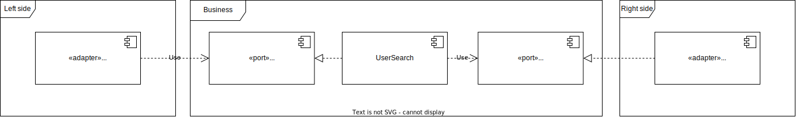

# Arquitectura hexagonal (Puertos y adaptadores)

`Arquitectura hexagonal` o `Patrón de puertos y adaptadores` es un patrón de arquitectura que se ha popularizado últimamente.

### ¿Qué es un patrón de arquitectura?
Antes de continuar es importante conocer que es un patrón de arquitectura y dónde es que tiene lugar en la arquitectura de un sistema.

Un patrón de arquitectura (o estilo de arquitectura) describe la estructura del sistema.
(Conocimiento de las características de arquitectura, decisiones de arquitectura y principios de diseño son necesarios para entender completamente la arquitectura de un sistema)

```

                    Características
            |----------------------------|
Descisiones | Arquitectura de un sistema | Principios de diseño
            |----------------------------|
                      Estructura

```

- Los patrónes son agnósticos a las tecnologías (incluyendo el propio lenguaje de programación).
- Los patrónes son más una idea conceptual que una una forma estricta forma de hacer las cosas.
  Por ejemplo: No definen el nombramiento de paquetes.

### Principios clave
El patrón de arquitectura hexagonal propone que la lógica de negocio es el centro de todo.

- Todo depende de la lógica de negocio
- La lógica de negocio no depende de nada
- La lógica esta protegida del exterior


### Conceptos
###### Lado izquierdo (o lado del usuario)
Es el lado a través del cual el usuario o los programas externos interactuarán con la aplicación. Contiene el código que permite estas interacciones. Típicamente, tu código de interfaz de usuario, tus rutas HTTP para una API, tus serializaciones JSON para programas que consumen tu aplicación están aquí.
Este es el lado donde encontramos los actores que manejan la Lógica de Negocio (adaptadores primarios)
###### Centro (lógica de negocio)
Contiene las entidades de negocio, reglas, procesos y casos de uso
###### Lado derecho (o lado del servidor)
Aquí es donde encontraremos lo que tu aplicación necesita, lo que impulsa para funcionar. Contiene detalles esenciales de la infraestructura, como el código que interactúa con tu base de datos, hace llamadas al sistema de archivos o el código que gestiona las llamadas HTTP a otras aplicaciones de las que dependes, por ejemplo.
En este lado se encuentran los actores gestionados por la Lógica de Negocio (adaptadores secundarios)
```
|-----------|     |---------|     |---------|
| Izquierdo | ==> | Negocio | <== | Derecho |
|-----------|     |---------|     |---------|
```

###### Puerto
Define el "cómo comunicarse con la lógica de negocio".
###### Adaptador
Un adaptador es responsable de comunicarse con el mundo exterior con la lógica de negocio a través de puertos definidos por la lógica de negocio.
- Adaptador primario (Conductor): Conduce a la lógica de negocio
- Adaptador secundario (Conducido): Son manejados por la Lógica de Negocio



### Estructura de archivos
```
.
├── cmd
│   └── {binary}          
└── internal
    ├── business        (Casos de uso, reglas de negocio y todo lo relacionado)
    └── infrastructure
        ├── input       (Todo lo relacionado con adaptadores primarios)
        └── output      (Todo lo relacionado con adaptadores secundarios)
```

### Hexagonal + Vertical slicing
"La suma del trabajo que se tiene que hacer en cada capa esta involucrada en el funcionamiento de una característica especifica"

```
.
├── cmd
│   └── {binary}
└── internal
    └── {feature}
        ├── business
        └── infrastructure
            ├── input
            └── output
```

### Referencias

[Vertical slicing - Wikipedia](https://en.wikipedia.org/wiki/Vertical_slice)

[Hexagonal architecture - Dr. Alistair Cockburn](https://alistair.cockburn.us/hexagonal-architecture/)

[Hexagonal Architecture: three principles and an implementation example](https://blog.octo.com/hexagonal-architecture-three-principles-and-an-implementation-example/)
